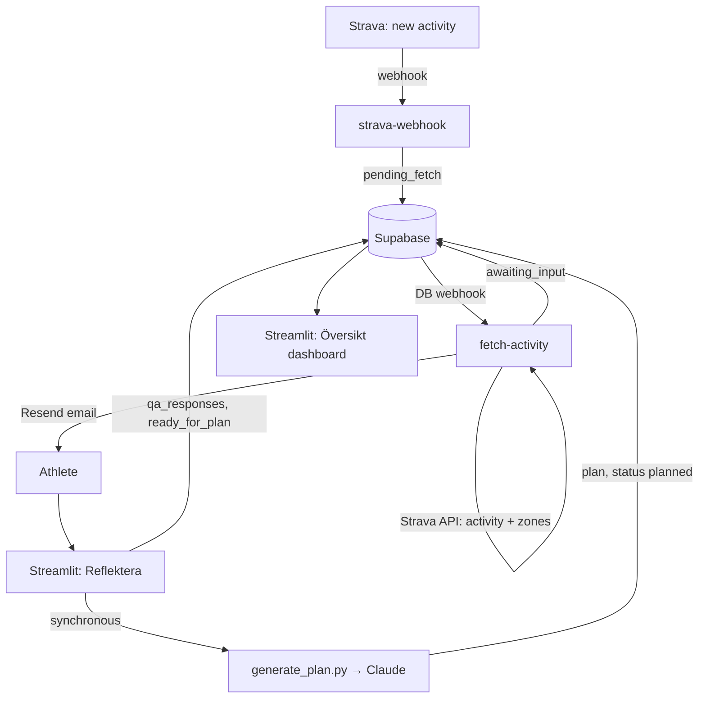

# Vasaloppet Training Pipeline

An event-driven, AI-assisted training system built toward Vasaloppet 2027. It captures every workout from Strava in real time, collects a short post-session reflection, and generates a rolling 7-day training plan — periodized against a long-term weekly plan, balanced across muscle groups, and anchored to the athlete's actual availability and fatigue. A Streamlit app is the human surface: reflection form, analytics dashboard, and live-tunable planning settings.

Everything runs serverless: Supabase (Postgres + Edge Functions) for data and event handling, Streamlit Community Cloud for the app, Resend for notifications, Claude for plan generation. No servers to maintain.

## How a workout flows through the system

1. A session is recorded on a Suunto watch and syncs to Strava.
2. Strava fires a webhook → the `strava-webhook` Edge Function inserts a `pending_fetch` row.
3. A database webhook triggers `fetch-activity`, which pulls the full activity + HR-zone distribution from Strava, computes training load, maps the muscle group, flips the row to `awaiting_input`, and sends a Resend email linking to the app.
4. In the Streamlit app (Reflektera), the athlete answers four questions: how it went, feeling (1–4), tiredness (1–4), and per-day availability for the next 7 days. Submission writes `qa_responses` and flips the session to `ready_for_plan`.
5. Plan generation runs synchronously on submit: Claude receives the session, the reflection, 8 weeks of history, load-by-muscle-group, the sport stress map, the goal (with derived phase and weeks-to-race), and this week's target from the long-term plan — and returns a 7-day plan (per day: sport, duration, intensity zone, rationale). The plan is stored append-only and the session is marked `planned`.
6. The dashboard (Översikt) shows the current plan (with today highlighted), actual-vs-target load across the full journey to race day, session history, and fatigue trends.



## The state machine

Each session row carries a status; each phase acts only on rows in its state. No long-running processes, and every step is independently retryable.

```
pending_fetch → awaiting_input → ready_for_plan → planned
```

Two decisions make this robust:

- **Loop prevention.** `fetch-activity` updates the same row that triggered it. It ignores any row whose status isn't `pending_fetch`, so its own write of `awaiting_input` can't re-trigger work. The DB webhook fires broadly; the in-function guard decides.
- **Retryable failures.** Errors during fetch/enrich are logged and the function returns 200 without touching the row — it stays `pending_fetch` for retry. The Resend email is isolated in its own try/catch: a failed notification never fails the pipeline. Plan-generation failures leave the session at `ready_for_plan` so generation can be retried; the reflection is already safely written.

## Repository layout

```
app.py                     Streamlit entry point (st.navigation)
pages/                     Reflektera, Översikt, Inställningar
generate_plan.py           7-day plan generation (Claude), weekly-target anchoring
long_term_plan.py          Long-term periodization generation (Claude)
backfill_strava.py         One-time import of historical Strava activities
supabase/functions/
  strava-webhook/          Strava event receiver (Edge Function)
  fetch-activity/          Enrichment + load math + Resend email (Edge Function)
requirements.txt
.env.example               Required environment variables (no values)
```

The Björns Hjärtevänner website (Lovable/React) is a separate repo and is not part of this pipeline; the two share nothing but a domain.

## Database schema

Seven tables in Supabase Postgres. `sessions` is the spine; the status column drives the state machine.

```sql
create table sessions (
  id uuid primary key default gen_random_uuid(),
  strava_activity_id bigint unique not null,
  status text not null default 'pending_fetch'
    check (status in ('pending_fetch','awaiting_input','ready_for_plan','planned')),
  sport_type text,
  start_date timestamptz,
  moving_time_s int,
  distance_m numeric,
  elevation_gain_m numeric,
  average_speed_mps numeric,
  pct_z1 numeric, pct_z2 numeric, pct_z3 numeric, pct_z4 numeric, pct_z5 numeric,
  has_hr_zones boolean default false,
  training_load numeric,
  muscle_group text,
  created_at timestamptz not null default now()
);

create table qa_responses (
  id uuid primary key default gen_random_uuid(),
  session_id uuid not null references sessions(id) on delete cascade,
  how_it_went text,
  feeling int check (feeling between 1 and 4),       -- 1 terrible .. 4 excellent
  tiredness int check (tiredness between 1 and 4),   -- 1 exhausted .. 4 fresh
  availability boolean[],                             -- 7 elements, index 0 = tomorrow
  answered_at timestamptz not null default now()
);

create table goal (
  id uuid primary key default gen_random_uuid(),
  race_name text not null default 'Vasaloppet 2027',
  race_date date,
  target text,
  updated_at timestamptz not null default now()
);

create table sport_stress_map (
  sport_type text primary key,
  muscle_group text not null check (muscle_group in ('lower','upper','full_body','other')),
  load_character text
);

create table plans (
  id uuid primary key default gen_random_uuid(),
  generated_at timestamptz not null default now(),
  trigger_session_id uuid references sessions(id),
  goal_snapshot jsonb,
  plan jsonb,        -- 7 day objects: {day,date,sport_type,duration_min,intensity_zone,rationale}
  summary text
);

create table weekly_targets (
  id uuid primary key default gen_random_uuid(),
  week_start date unique not null,   -- Monday of each ISO week
  target_load numeric not null,
  phase text,                        -- base | build | peak | taper
  notes text,
  created_at timestamptz not null default now()
);

create table app_settings (
  key text primary key,
  value text,
  updated_at timestamptz not null default now()
);
```

`sport_stress_map` is seeded with the sport → muscle-group mapping (Run/TrailRun → lower, RollerSki/Swim → upper, NordicSki/BackcountrySki → full_body, Ride → lower, Workout → other) plus a `default` catch-all row, so an unmapped Strava sport type never breaks the pipeline — it lands as `other` until mapped. `plans` is append-only: every generated plan is preserved, so plan history is queryable and nothing is ever overwritten.

## Training load

Zone boundaries are calibrated in Strava; the pipeline consumes the returned time-in-zone shares, so recalibrating in Strava flows through automatically. When an activity returns exactly five heart-rate buckets:

```
training_load = moving_time_min × (pct_z1×1 + pct_z2×2 + pct_z3×3 + pct_z4×4 + pct_z5×5)
```

When zone data is absent (manual entries, no HR strap) the load falls back to `moving_time_min × 2` — a steady-Z2 equivalent — and the row is flagged `has_hr_zones = false` so the dashboard can distinguish measured from estimated load.

## Plan generation

**Two planning horizons, one anchor.** A long-term plan (`long_term_plan.py`, regenerable from the Settings page) asks Claude for a week-by-week periodization from today to race week: target load per week with a sawtooth of recovery weeks, phased base → build → peak → taper. The rolling 7-day planner (`generate_plan.py`) then anchors each week's plan to that target: the prompt states the current week's load budget and what has already been completed, so short-term plans aggregate toward the long-term curve rather than drifting.

**The 7-day prompt assembles:** the triggering session and its reflection, trailing 8 weeks of history, recent load aggregated by muscle group, the sport stress map, the goal with derived phase and weeks-to-race, the 7-day availability array, and the weekly target. Constraints: respect availability exactly (rest on unavailable days), balance muscle-group load against recent history, bias heavily toward running and rollerskiing as the Vasaloppet-specific modalities (cross-training only as deliberate recovery/balancing), fit the periodization phase, and adapt volume to reported fatigue. Output is strict JSON — per day: sport, duration, intensity zone (Z1–Z5 or rest), one-line rationale — at temperature 0.

**The prompt is data, not code.** The full template lives in `app_settings` (key `plan_prompt_template`) and is editable from the Settings page in the deployed app, with documented placeholders and a reset-to-default. Sport bias, intensity rules, and constraints can be tuned from a phone after a run, without a deploy. A missing row falls back to the built-in default.

## The Streamlit app

Three pages, deployed on Streamlit Community Cloud as a **private app** (viewer allowlist — no in-app auth code needed once embedding was dropped):

- **Reflektera** — lists `awaiting_input` sessions; the four-question form; on submit, writes the reflection, flips status, and generates + displays the plan synchronously.
- **Översikt** — goal header (race, date, weeks left, phase); the current 7-day plan with today highlighted; a full-journey combo chart (stacked actual weekly load by muscle group vs the long-term target line); training-load and fatigue-vs-load trends; session history joined with reflections. Filterable by date range, sport, and muscle group.
- **Inställningar** — regenerate the long-term plan; edit the planning prompt template live.

Credentials resolve from `st.secrets` on Community Cloud with a `.env` fallback locally, so the same code runs in both environments.

## Setup and one-time bootstrap

- **Strava OAuth.** Access tokens live 6 hours; the durable credential is a refresh token obtained once via the authorization-code flow with scope `read,activity:read_all` (required for HR zones on private activities). Every run exchanges it for a fresh access token.
- **Strava push subscription.** Created once via the push-subscriptions endpoint, pointing at the deployed `strava-webhook` URL. Strava validates the endpoint synchronously at creation (the function must echo `hub.challenge`), so deploy the function first. One subscription per application.
- **Database webhook.** On the `sessions` table (Insert + Update) → invokes `fetch-activity`. The in-function status guard makes broad firing safe.
- **Secrets live in three places:** Supabase Edge Function secrets (`STRAVA_*`, `RESEND_API_KEY`, `RESEND_TO_EMAIL`), Streamlit Community Cloud secrets (`SUPABASE_URL`, `SUPABASE_SERVICE_ROLE_KEY`, `ANTHROPIC_API_KEY`), and a local `.env` for development (see `.env.example`). The service-role key is server-side only — it never ships to a browser, which is what lets the app bypass RLS safely.
- **Historical backfill.** `backfill_strava.py` imports the trailing 8 weeks of real Strava activities (with per-activity zone fetches and the same load math as the live pipeline), upserting on `strava_activity_id` so it is idempotent and collision-safe with the live webhook. Inserted with status `planned` so backfilled rows feed the dashboard and the planner's history without entering the reflection flow.

## Known limitations and decisions

- **Edge Functions deploy via the Supabase dashboard, not the CLI.** The project's Management-API access returns 403 on CLI deploys and secret-setting even for the org owner. Source of truth is this repo; deployment is a manual paste into the dashboard editor, with "Verify JWT" disabled (Strava and the DB webhook call unauthenticated). Repo edits are inert until re-pasted — the one recurring operational gotcha.
- **HR-zone parsing requires exactly five buckets.** Any other count falls back to estimated load, flagged and logged. Zone calibration is Strava's job, not the pipeline's.
- **The planner's history window is trailing 8 weeks** — a cost/context dial, set in `generate_plan.py`.
- **Availability convention:** `availability[0]` = tomorrow. The form and the planner both assume it; it is enforced by convention, not the schema.
- **Webhook handles activity-create only.** Edits/deletes in Strava don't propagate; a deleted activity leaves a stale row.
- **Plan generation is synchronous with the reflection submit.** The only path to `ready_for_plan` is the form, so no separate trigger is needed — but a plan is only generated when a reflection is answered.
- **No fabricated history.** The database was seeded exclusively from real Strava activities via the backfill; training strategy discussed elsewhere was never converted into synthetic session rows, because invented history would mis-calibrate the planner's fitness assessment.

## Origin

Built as a pair-programming project with Claude (planning/review) and Claude Code (implementation), as a demonstration of end-to-end AI workflow automation: event-driven capture, human-in-the-loop reflection, LLM planning with structured output, and an analytics surface — across Strava, Supabase, Resend, Anthropic, and Streamlit, with no dedicated infrastructure.
